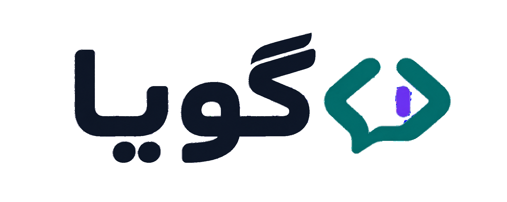
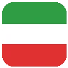
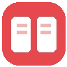

<div align="center">
  
</div>

# گویا (Goya) 

> **گویا — زبانی که حرف می‌زنه.**
> برنامه‌نویسی مدرن، به فارسی.

گویا یه زبان برنامه‌نویسی **واقعی و فارسی** است: کلیدواژه‌ها فارسی، اعداد فارسی،
خطاها فارسی، و تاریخ شمسی از روز اول داخل خود زبان. بدون آکولاد، بدون سمی‌کالن —
بلوک‌ها با تورفتگی مثل پایتون، تا تایپ فارسی راحت بمونه.

مفسر گویا با پایتون نوشته شده — یعنی کل اکوسیستم پایتون پشتشه — و با
[PyInstaller] به یه فایل `goya.exe` تک‌فایله تبدیل می‌شه که کاربر بدون نصب هیچی اجراش می‌کنه.

##  ویژگی‌ها

- **کلیدواژه‌های فارسی**: `اگر`، `وگرنه`، `تا وقتی که`، `برای هر`، `تابع`، `برگردان`
- **اعداد فارسی و لاتین**: `۱۲۳` و `123` هر دو قبول‌ان؛ خروجی همیشه با رقم فارسی
- **رشته با هر دو گیومه**: `"متن"` یا `«متن»`
- **نرمال‌سازی خودکار**: `ي/ی`، `ك/ک`، نیم‌فاصله، ارقام عربی — همه یکی حساب می‌شن
- **اپراتورهای کلمه‌ای**: `بزرگتر از`، `ضربدر`، `تقسیم بر`، `باقیمانده` (سمبل‌ها هم قبول)
- **تاریخ شمسی توکار**: `امروز()` → `۱۴۰۵/۰۷/۱۷`
- **خطاهای فارسی آدم‌فهم** با شماره سطر و نمایش خود سطر

##  محیط گویا (IDE)

یه محیط برنامه‌نویسی فارسی و راست‌چین تو مرورگر خودت — با رنگ‌آمیزی زنده‌ی کد،
قالب‌های آماده (تایپ کن «اگر»، کل ساختار میاد)، پنل ورودی، تم روشن/تیره و دکمه‌ی اجرا:

```bash
python -m goya ide
```

مرورگر خودش باز می‌شه روی `http://127.0.0.1:...` — همه‌چیز محلیه، هیچی جایی نمی‌ره.

##  شروع سریع

```bash
python -m goya run examples/salam.goya   # اجرای فایل
python -m goya repl                      # محیط تعاملی
```

```text
گویا> بگو(۲ + ۳ * ۴)
=> ۱۴
گویا> تابع مربع(عدد)
   ...     برگردان عدد * عدد
   ...
گویا> مربع(۷)
=> ۴۹
```

##  یه نگاه به زبان

```text
## فاکتور خرید — کامنت با ##
خرید = ["نان"، "شیر"، "چای"]

تابع جمع_لیست(لیست)
    جمع = ۰
    برای هر قیمت در لیست
        جمع = جمع + قیمت
    برگردان جمع

اگر طول(خرید) > ۲
    بگو("فاکتور سنگینه: " + متن(جمع_لیست([۱۲۰۰۰، ۴۵۰۰۰، ۸۵۰۰۰])) + " تومان")
وگرنه
    بگو("سبک‌ه")
```

##  کلیدواژه‌ها

| فارسی | کار | مثل |
|--------|-----|-----|
| `بگو` / `بنویس` | چاپ | `print` |
| `بپرس` / `بگیر` | ورودی از کاربر | `input` |
| `اگر` / `وگرنه اگر` / `وگرنه` | شرط | `if / elif / else` |
| `تا وقتی که` | حلقه شرطی | `while` |
| `برای هر x از a تا b` / `در` | حلقه | `for` |
| `تابع` / `برگردان` | تابع | `def / return` |
| `بشکن` / `ادامه` | کنترل حلقه | `break / continue` |
| `درست` / `غلط` / `پوچ` | مقدار | `True / False / None` |
| `و` / `یا` / `نه` | منطق | `and / or / not` |

توابع داخلی: `طول`، `عدد`، `متن`، `گرد`، `تصادفی(از، تا)`، `امروز()` — و برای پنجره: `فرم`، `دکمه`، `برچسب`، `کادر`، `پیام`

نمونه‌ی گرافیکی: [examples/mashin-hesabi-grafiki.goya](examples/mashin-hesabi-grafiki.goya) — یه پنجره‌ی واقعی با دکمه و رویداد

##  نقشه راه

- **فاز ۱ (انجام شده)** — مغز زبان: مفسر کامل، REPL، خطاهای فارسی، تست + **محیط گرافیکی (IDE) راست‌چین**
- **فاز ۲ ✅ (موتور)** — فرم، دکمه، برچسب، کادر، پیام + رویداد کلیک با قرارداد اسم — دسترسی نقطه‌ای: `کادر۱.متن`
- **فاز ۳** — طراح بصری فرم (درگ‌ودراپ) + خروجی `goya.exe` تک‌فایله
- **فاز ۴** — کتابخانه‌های کاربردی (اکسل/CSV/HTTP)، سایت مستندات

##  نصب (برای توسعه)

```bash
git clone https://github.com/alizamani1616/goya
cd goya
python -m goya run examples/fizzbuzz.goya
python -m unittest discover -s tests   # تست‌ها
```

## English (summary)

**Goya** is a real programming language in Persian: Persian keywords, Persian
digits, beginner-friendly Persian error messages, and a built-in Jalali
(Shamsi) calendar — `امروز()` returns today's Persian date. Blocks are
indentation-based (no braces, no semicolons) so Persian typing stays smooth.
The interpreter is written in pure Python and can be frozen into a single
portable `goya.exe` with PyInstaller. Roadmap: built-in visual form builder,
drag-and-drop designer, and a batteries-included standard library.

##  هویت بصری

| رنگ | کد | کاربرد |
|------|-----|--------|
| فیروزه‌ای | `#0F766E` | رنگ اصلی برند و دکمه‌ها |
| بنفش | `#7C3AED` | تأکیدها و عناصر ویژه |
| سرمه‌ای | `#111827` | زمینه تیره و متن در تم روشن |
| سفید یخی | `#F8FAFC` | زمینه روشن و متن در تم تیره |
| فیروزه‌ای روشن | `#2DD4BF` | لینک‌ها و تأکیدها در تم تیره |
| خاکستری روشن | `#CBD5E1` | متن‌های فرعی در تم تیره |

##  لایسنس

MIT — آزاد و رایگان.
